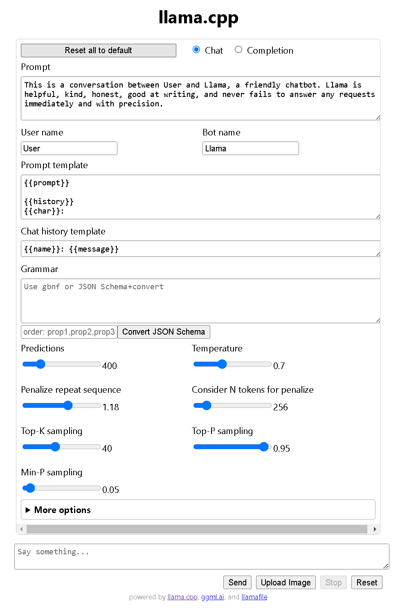

# Llamafile

Llamafile is a Mozilla project that lets you distribute and run LLMs in a single file. However, Windows has a 4GB linit for executables which means you must download the executable and LLM seperately.

Llamafile is based on [llama.cpp](https://github.com/ggerganov/llama.cpp), an inference engine that lets you run LLMs locally. Llama.cpp based engines use models in the `GGUF` format, you can find models in the GGUF format on [Hugging Face](https://huggingface.co/models?sort=trending&search=gguf).

## Downloading Llamafile and LLMs

Download the llamafile executable from Mozillas's [GitHub repository](https://github.com/Mozilla-Ocho/llamafile/releases/) using a browser. Note: If  you use the Invoke-WebRequest cmdlet to download large files set `$ProgressPreference` to 'SilentlyContinue' to improve download speed and set the `-OutFile` option to write it locally and prevent a download timeout.

Here's how to download llamafile and save it with a `exe` file extension, which is needed to run llamafile on Windows. If you use a browser to download llamafile, rename it with a `.exe` extension. In addtion, download a LLM in the GGUF format:

```PS
$ProgressPreference = 'SilentlyContinue'

Invoke-WebRequest https://github.com/Mozilla-Ocho/llamafile/releases/download/0.8.13/llamafile-0.8.13 -Outfile llamafile-0.8.13.exe

Invoke-WebRequest https://huggingface.co/lmstudio-community/Meta-Llama-3.1-8B-Instruct-GGUF -OutFile Meta-Llama-3.1-8B-Instruct-GGUF
```

## Running Llamafile

To run llamafile with an LLM, use the following command:

```PS
llamafile-0.8.13.exe -m Meta-Llama-3.1-8B-Instruct-GGUF
```

Use the llamafile `-ngl` flag to use a GPU if you have one. As the context windows (the amount of text that a LLM can process) increase in size, they may exceeed the amount of memory on the GPU. The `-c` flag sets the size of the context window. Start the context window at 2048 mb and increase as needed.

```PS
llamafile-0.8.13.exe -ngl 9999 -c 2048 -m Meta-Llama-3.1-8B-Instruct-GGUF
```

## Client application

Llamafile includes a built in chat client that opens a web browser window.




